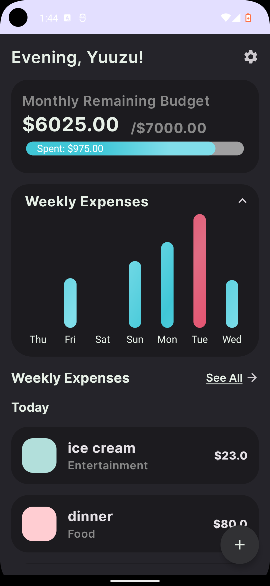
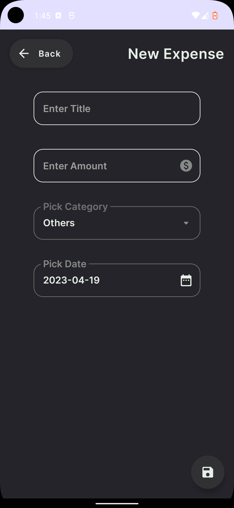
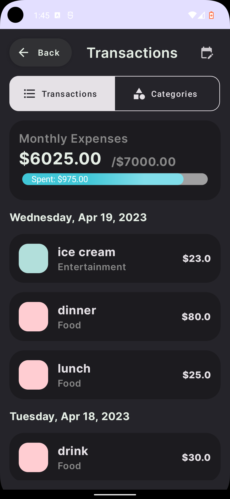
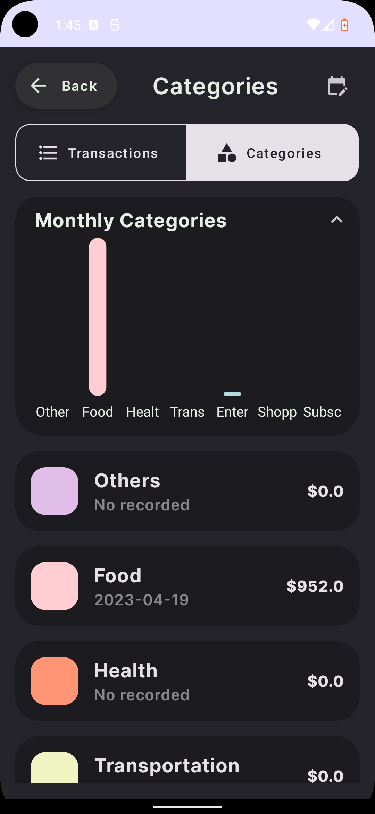

# 💰 Expense App 💰

Expense App is a simple and easy-to-use application for tracking your daily expenses. With a clean and intuitive interface, you can easily record your expenses, view your spending patterns, and set budgets for different categories.

## Screenshots & Demo

## Features

---

- Create and edit expenses with ease
- Set budgets for monthly expenses
- View monthly expenses with bar charts 
- no account required, no internet connection required

## Getting Started

---

1. git clone this repository.
2. open android studio and open the project.
3. waiting for gradle to finish building.
4. run the app on your device or emulator.
5. enjoy the app.
